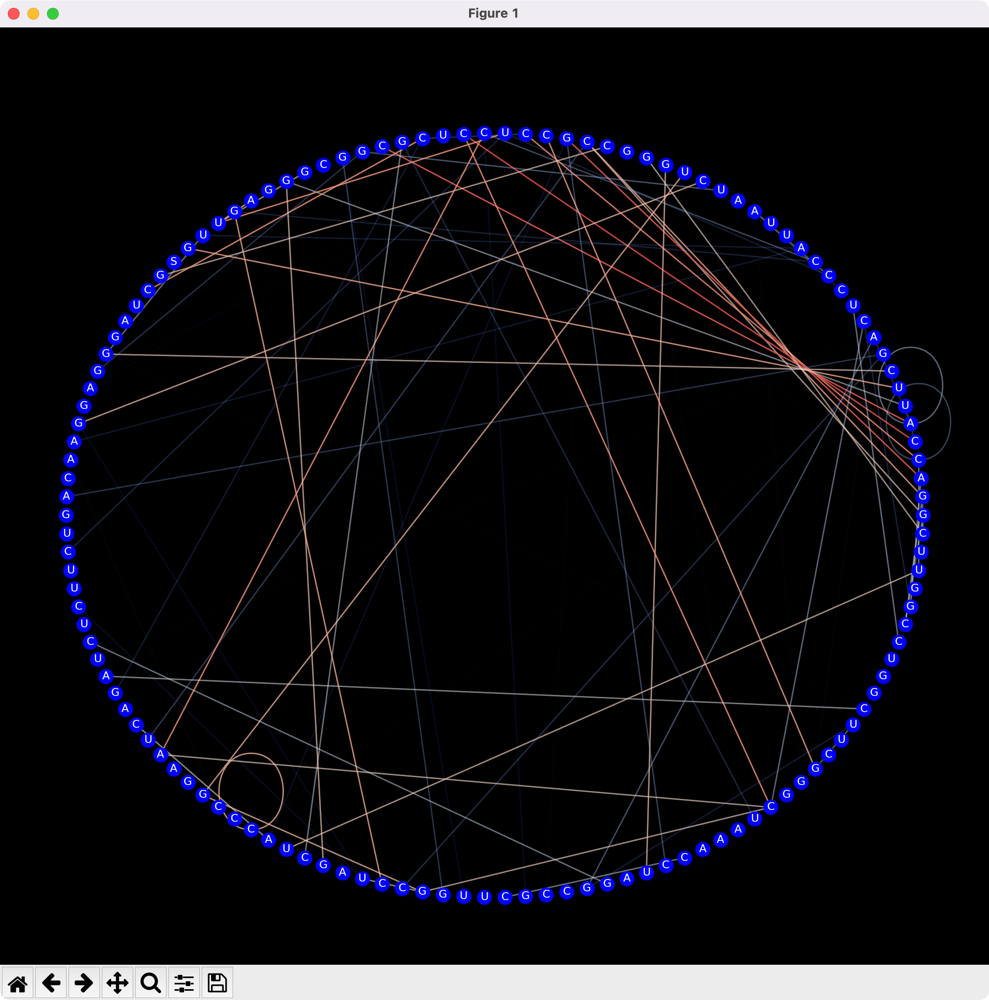

# Donut Diagram  
Suggestion from Dr. Nawwaf Kharma - Concordia University  
  
Author: Vincent Beaulieu  
Date: 14 September 2022  
  
## Info:  
Display in a circular diagram the folding probabilities of an RNA sequence using a coolwarm colormap  
  
## Requirements:  
The probability matrix ".prob" generated by VARNA RNA.  
The whole rna sequence used for the folding. (eg.: a fasta/txt/csv/etc. file containing the sequence)  
The toolbox.py library available in this Repo.  
  
## Comments:  
This code is mostly generalized and may require minimal modification to adapt it to your particular file input.  
These modifications are:  
- The filepath.  
- The line number at which the whole RNA sequence is situated in the input file.  
  
  
  
